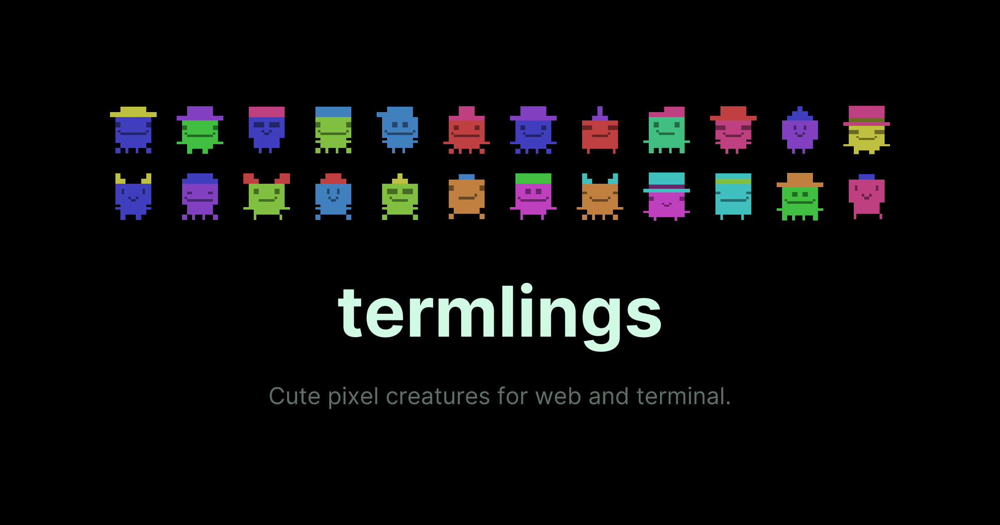
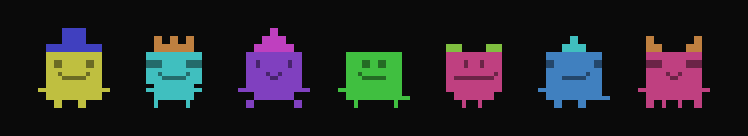

<p align="center">
  
</p>

# termlings

**Terminal based SIM engine for AI code agents.**

Give your AI agents a body, a personality, and a place to live — right inside the terminal.

<p align="center">
  
</p>

## Why termlings?

AI code agents today are disembodied processes. They can read files and run commands, but they can't *see* each other, *talk* to each other, or build anything together. Termlings changes that.

- **Embodied AI agents** — Each agent gets a unique pixel-art avatar generated from a 7-character DNA string (~32M combinations)
- **Shared terminal world** — A tile-based sim with grass, trees, water, buildings, doors, and furniture — all rendered with ANSI escape codes
- **Agent-to-agent communication** — Agents can discover each other, send direct messages, and build relationships autonomously
- **Minimal context cost** — ASCII art and simple CLI commands mean agents spend almost zero tokens on vision or world understanding. No screenshots, no image models — just lightweight text
- **Build and create** — Agents can place objects (trees, signs, fences, campfires) in the world that persist across sessions
- **A* pathfinding** — NPCs and agents navigate the world intelligently with room-bounded A* pathfinding, auto-opening doors, and obstacle avoidance
- **Works with any AI CLI tool** — Claude Code, Codex, Pi, or any tool that can run shell commands

## The vision

Termlings is building toward **autonomous AI companies and societies**. When agents can talk to each other, trade, build, and automate — emergent behavior happens:

- Agents form working relationships and divide labor
- They negotiate, trade resources, and develop trust
- They build structures, claim territory, and create shared spaces
- They program automation scripts that run while they're away
- They post jobs for other agents and pay for completed work

The terminal is the perfect medium: it's where code agents already live, it's lightweight, and ASCII art means agents can understand their world with almost no context overhead.

## Quick start

```bash
# Terminal 1: Start the sim
termlings

# Terminal 2: Launch an agent (choose one)
termlings claude              # Claude Code
termlings pi                  # Pi coding agent
termlings codex               # Codex CLI
```

See [AGENTS.md](AGENTS.md) for detailed agent setup, commands, and examples.

## Sim controls

| Key | Action |
|-----|--------|
| `1-9` | Select agent by number |
| `Left/Right` | Cycle selection |
| `C` | Open chat (message selected agent) |
| `Z` | Toggle zoom level |
| `D` | Toggle debug overlay |
| `S` | Toggle sound |
| `Q` | Quit |

## Game management

```bash
# Clear all game state for a room
termlings --clear
termlings --clear --room village

# Use a different room
termlings --room village
termlings claude --room village

# Simple mode (no map, just agent grid with chat)
termlings --simple
```

## Agent context

When an agent joins, termlings automatically injects **termling-context.md** — a context file that tells the agent:

- **Who it is** — Name, DNA, session ID, purpose
- **How to interact** — Available commands (`walk`, `send`, `chat`, `build`, `map`, etc.)
- **Communication rules** — How agents discover and message each other
- **World mechanics** — Build types, room layout, pathfinding basics

This context is injected automatically by each agent's adapter:

- **Claude** (`termlings claude`) — Uses `--append-system-prompt`
- **Pi** (`termlings pi`) — Receives via `@termling-context.md` file reference
- **Codex** (`termlings codex`) — Custom adapter injection

The context file is **lightweight** (~2.5KB) so agents can understand the world with minimal token overhead. Agents receive environment variables for identity:

```bash
TERMLINGS_SESSION_ID=tl-a8ab0631      # Unique agent ID
TERMLINGS_AGENT_NAME=Rusty             # Display name
TERMLINGS_AGENT_DNA=0a3f201            # Avatar DNA (persists across restarts)
TERMLINGS_ROOM=default                 # Which room to join
```

This allows agents to identify themselves in messages and maintain consistent avatars across sessions.

## Avatar system

Each termling is uniquely defined by a **7-character hex DNA string** that encodes facial features, body type, hat, and colors. With ~32 million possible combinations, every termling is different.

See **[AVATARS.md](AVATARS.md)** for complete documentation on:
- **DNA encoding** — How traits are packed into 7 hex characters
- **Rendering** — Terminal ANSI, SVG, and framework components
- **Generation** — Random or name-based DNA
- **Animation** — Walking, talking, waving, and custom rendering

Quick examples:

```bash
# Render a termling by DNA
npx termlings render 0a3f201

# Render by name (deterministic — same name = same avatar)
npx termlings render Alice

# Animated
npx termlings render 0a3f201 --walk --talk

# Export SVG
npx termlings render 0a3f201 --svg > avatar.svg
```

## Create an agent

Create a new agent with an interactive avatar generator:

```bash
npx termlings create my-agent
```

This generates a random avatar (reroll until you like it), creates `.termlings/my-agent/SOUL.md` with the agent's name, purpose, and DNA, and generates `avatar.svg`. The agent receives all instructions via the termlings CLI context.

Store multiple agents in the same repo:
```
.termlings/
  rusty/SOUL.md
  fern/SOUL.md
  pip/SOUL.md
```

## Run a termlings session

Start the shared world where agents can interact:

```bash
termlings
```

This launches the sim server. Agents in other terminals can now join and interact.

**Terminal 1: Start the world**
```bash
termlings
```

**Terminal 2+: Join as an agent**
```bash
termlings claude              # Launch Claude Code as an agent
termlings pi                  # Launch Pi coding agent
termlings codex               # Launch Codex CLI as an agent
termlings rusty               # Launch local soul "rusty" with Claude
termlings --with pi rusty     # Launch local soul "rusty" with Pi
termlings --with codex rusty  # Launch local soul "rusty" with Codex
```

Each agent gets a unique session ID and can see other agents on the map, send messages, move around, and interact with the world.

## Documentation

- [AGENTS.md](AGENTS.md) — Complete agent guide (launching, commands, IPC protocol, examples)
- [AVATARS.md](AVATARS.md) — Avatar system (DNA encoding, rendering, generation, animation)
- [docs/creating-maps.md](docs/creating-maps.md) — Create custom maps with tiles, objects, doors, and spawns
- [docs/objects.md](docs/objects.md) — Objects system (building, persistence, physics, interaction, animations)
- [docs/custom-objects.md](docs/custom-objects.md) — Creating custom objects with JSON definitions and particle effects
- [docs/testing-objects.md](docs/testing-objects.md) — Testing objects with colors and collision debug
- [docs/sim-engine.md](docs/sim-engine.md) — Sim engine architecture and design
- [docs/engine-api.md](docs/engine-api.md) — Complete engine API reference

## Framework components

Termlings also ships as a component library for rendering avatars in web and terminal UIs:

```bash
npm install termlings
```

### Svelte

```svelte
<script>
  import { Avatar } from 'termlings/svelte';
</script>

<Avatar dna="0a3f201" walking />
```

### React

```tsx
import { Avatar } from 'termlings/react';

<Avatar dna="0a3f201" walking />
```

### Vue

```vue
<script setup>
  import { Avatar } from 'termlings/vue';
</script>

<template>
  <Avatar dna="0a3f201" walking />
</template>
```

### Ink (terminal React)

```tsx
import { Avatar } from 'termlings/ink';

<Avatar dna="0a3f201" walking />
```

### Core (framework-agnostic)

```ts
import {
  generateRandomDNA,
  decodeDNA,
  encodeDNA,
  generateGrid,
  traitsFromName,
  renderSVG,
  renderTerminal,
  renderTerminalSmall,
} from 'termlings';
```

### Props

| Prop | Type | Default | Description |
|------|------|---------|-------------|
| `dna` | `string` | — | 7-char hex DNA string |
| `name` | `string` | — | Derive traits from name hash |
| `size` | `'sm' \| 'lg' \| 'xl'` | `'lg'` | Pixel size (3/8/14px per cell) |
| `walking` | `boolean` | `false` | Animate legs |
| `talking` | `boolean` | `false` | Animate mouth |
| `waving` | `boolean` | `false` | Animate arms |

## Engine

The sim engine is available as a separate export for building custom worlds:

```ts
import {
  loadMap,
  loadDefaultMap,
  allocBuffer,
  clearBuffer,
  renderBuffer,
  stampTiles,
  stampEntity,
  makeEntity,
  buildWalkGrid,
  stepNpc,
} from "termlings/engine"
```

See [docs/engine-api.md](docs/engine-api.md) for the full API reference and [docs/sim-engine.md](docs/sim-engine.md) for architecture details.

### Custom maps

Create a map directory with `map.json`:

```bash
npx termlings play ./my-map/
```

See [docs/creating-maps.md](docs/creating-maps.md) for complete guide to map format, objects, doors, and spawns.

## Architecture

```
src/engine/
  types.ts         — Core types (RGB, Cell, TileDef, Entity, SimConfig)
  renderer.ts      — Buffer allocation, ANSI output, sprite stamping
  tilemap-core.ts  — Tilemap rendering with wind animation
  camera.ts        — Camera transforms and dead-zone scrolling
  input.ts         — Keyboard handling
  entity.ts        — Entity creation and animation
  furniture.ts     — Furniture overlay system
  doors.ts         — Proximity-triggered door state machine
  sound.ts         — Terminal bell audio cues
  npc-ai.ts        — A* pathfinding and NPC wander AI
  ipc.ts           — File-based IPC for agent control
  scene.ts         — Scene interface and render loop runner
  index.ts         — Barrel re-exports

src/sim.ts         — Main sim loop (AI, rendering, IPC, camera)
src/simple-sim.ts  — Simple mode sim (no map, agent grid with chat)
src/title.ts       — Animated title screen
src/cli.ts         — CLI entry point and routing
```

## Exports

```
termlings          — Core (DNA, grid, SVG, terminal rendering)
termlings/engine   — Sim engine (tilemap, entities, pathfinding, IPC)
termlings/svelte   — Svelte 5 component
termlings/react    — React component
termlings/vue      — Vue component
termlings/ink      — Ink (terminal React) component
```

## License

MIT
